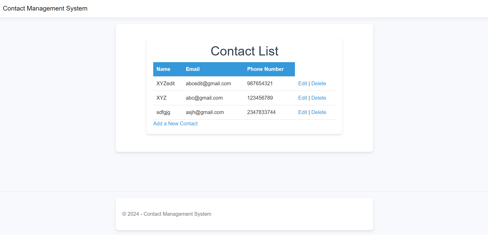
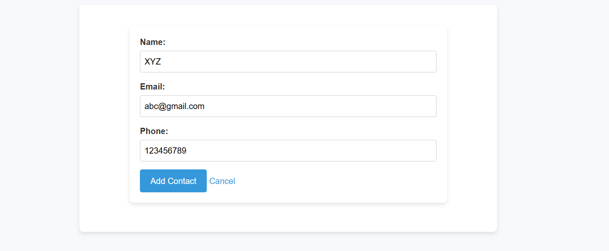
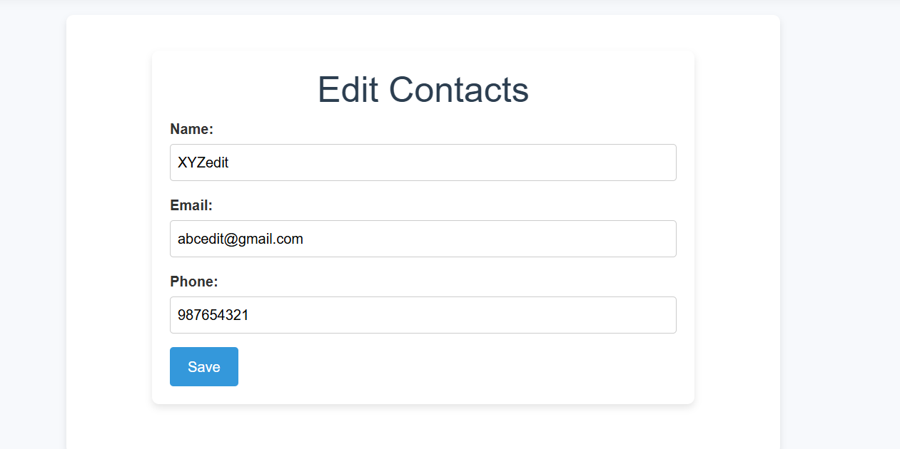
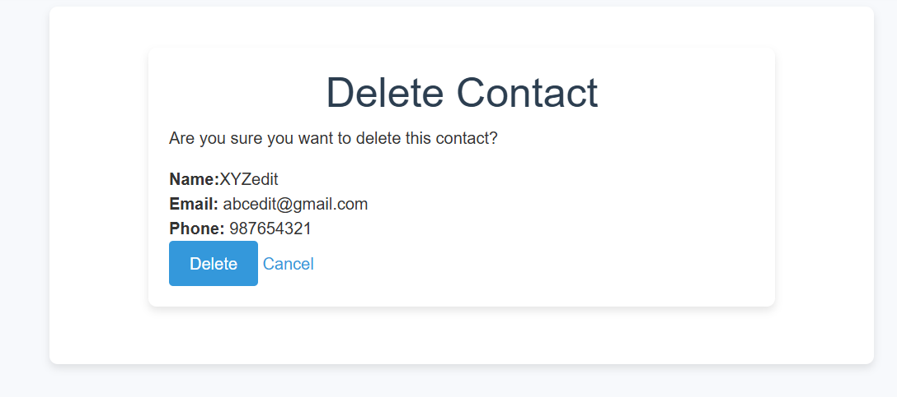

# **Contact Management System (CMS)**

## **Project Overview**
The **Contact Management System** is a web-based application designed to simplify the management of personal and professional contacts. Built using **ASP.NET MVC**, this system allows users to store, edit, delete, and search for contact information efficiently. It demonstrates the implementation of CRUD operations in a well-structured MVC architecture, making it a practical project for showcasing development skills.

---

## **Features**
- **Add Contacts**: Create new contact records with essential details such as name, email, phone number, and address.
- **Edit Contacts**: Update existing contact details in just a few clicks.
- **Delete Contacts**: Remove contacts permanently from the system.
- **Responsive Design**: Optimized for both desktop and mobile devices.

---

## **Technology Stack**
- **Front-End**: HTML, CSS, Bootstrap
- **Back-End**: ASP.NET MVC (C#)
- **Database**: SQL Server (or any supported database)
- **IDE**: Visual Studio Code
- **Version Control**: Git & GitHub

---

## **Setup Instructions**
To run the project locally:

1. Clone the repository to your local machine.
2. Configure the connection to your database (if needed).
3. Build and run the project using your preferred IDE.

---

## **Screenshots**
### Home Page

### Add Contact Page

### Edit Contact Page

### Delete Contact Page

---

## **Future Improvements**
1. Implement user authentication and authorization.
2. Add advanced search filters (e.g., by email or phone).

---

## **License**

This project is licensed under the MIT License.See [`LICENSE`](./LICENSE) for more information.
.

---

## **Contributing**

Contributions are welcome! Feel free to fork the repository, create a new branch, and submit a pull request.

---

## **Contact**

For any inquiries or feedback, feel free to reach out:

Email: jaisonalex872@gmail.com

